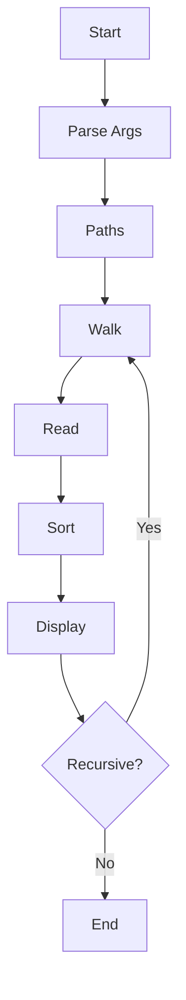

# my-ls Project Structure & Design

## 1. Folder Structure

```bash
my-ls/
├── go.mod
├── main.go
├── design.md
└── internal/
    ├── core/
    │   └── core.go
    ├── meta/
    │   ├── meta_unix.go
    │   └── meta_windows.go
    ├── models/
    │   └── models.go
    ├── parser/
    │   ├── parser.go
    │   └── parser_test.go
    ├── reader/
    │   ├── reader.go
    │   └── reader_test.go
    └── sorter/
        ├── sorter.go
        └── sorter_test.go
```

---

## 2. Core Data Structures

```go
type Flags struct {
    Long bool
    Rec  bool
    All  bool
    Rev  bool
    Time bool
}

type Entry struct {
    Name string
    Path string
    Info os.FileInfo
}
```

---

## 3. Function Skeleton

### main.go

```go
func main() {
    flags, paths, _ := ParseArgs(os.Args[1:])
    if len(paths) == 0 {
        paths = []string{"."}
    }

    for i, path := range paths {
        showHeader := len(paths) > 1 || flags.Rec
        Walk(path, flags, showHeader && i >= 0)
    }
}
```

---

### parser.go

```go
func ParseArgs(args []string) (Flags, []string, error) {
    return Flags{}, []string{}, nil
}
```

---

### reader.go

```go
func ReadEntries(path string, flags Flags) ([]Entry, error) {
    return []Entry{}, nil
}
```

---

### sorter.go

```go
func SortEntries(entries []Entry, flags Flags) {}
```

---

### display.go

```go
func PrintEntries(path string, entries []Entry, flags Flags, showHeader bool) {}
```

---

### walker.go

```go
func Walk(path string, flags Flags, showHeader bool) error {
    return nil
}
```

---

## 4. Execution Flow

```
User Input → ParseArgs → Walk → ReadEntries → Sort → Display → (Recurse if -R)
```

---

## 5. Flowchart (ASCII)

```
Start → Parse Args → Walk → Read → Sort → Display → Recurse? → End
```

---

## 6. Mermaid Flowchart


